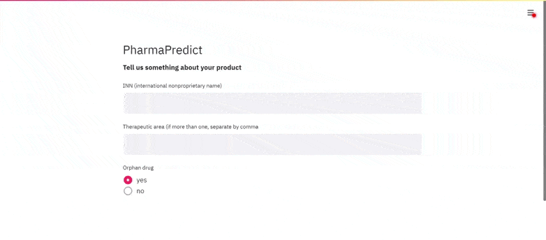

# PharmaPredict
Based on historical data of authorised, refused and withdrawn drug/indication pairs we aim at predicting market authorisation of new pharmaceutical candidates. Given the simple user input of INN (international nonproprietary name), therapeutic area and orphan medicine status we aggregate additional features from the ClinicalTrials.gov and PubMed APIs. Apart from numerical and one categorial features, we use Tf-idf-vectoriced abstracts to train a Random Forest Classifier.

## Data
### Sources
[EMA](https://www.ema.europa.eu/en/medicines/download-medicine-data)

[PubMed](https://pubmed.ncbi.nlm.nih.gov/)

[ClinicalTrials.gov](https://clinicaltrials.gov/)

### Construction of dataset
From the EMA Excel sheet (see above), colulmns 'Medicine name', 'Therapeutic area', 'INN', 'Authorisation status', 'Generic, 'Biosimilar', 'Orphan medicine' and 'First published' were selected. The file was filtered to only show entries with Authorisation status 'refused' or 'authorised'.
Entries in 'Therapeutic area' were manually transformed to represent multiple therapeutic areas separated by comma.
For each row, searches in the PubMed and ClinicalTrials API were conducted using the following formula: (therapeutic_area_1 OR therapeutic_area_2 etc) AND (INN) AND (date < 'First published'). From these search queries, the remaining columns were filled.

### Description of columns
**Medicine name**: Brand name of the drug

**Therapeutic area**: Indications (diseases against which this drug can be used) as fould in the EMA spreadsheet. If there is more than one indication, they are separated by comma (this collumn was manually transformed) 

**INN**: Introduction. International Nonproprietary Names (INN) identify pharmaceutical substances or active pharmaceutical ingredients. Each INN is a unique name that is globally recognized and is public property. A nonproprietary name is also known as a generic name. (definition by WHO)

**Authorisation status**: 0: drug has been accepted by EMA. 1: refused by EMA

**Generic**: 0: no 1: yes

**Biosimilar**: 0: no 1: yes

**Orphan medicine**: 0: no 1: yes

**First published**: This is the earliest date provided in the EMA spreadsheet. It is the date of publication of the first report by EMA on this application.

**n_trials**: Total number of trials found of ClinicalTrials.gov matching the Therapeutic area and INN as well as First published

**status_not_yet_recruiting**: Number of trials which do not yet recruit participants

**status_recruiting**: Number of trials which recruit participants

**status_enrolling_by_invitation**: Number of trials which recruit participants by invitation

**status_active_not_recruiting**: Number of trials which are running but not/no longer recruiting participants

**status_suspended**: Number of trials which which are suspended

**status_terminated**: Number of trials which are terminated

**status_completed**: Number of trials which are completed

**status_withdrawn**: Number of trials which were withdrawn

**status_unknown**: Number of trials whose status is unknown

**org_fed**: Number of trials organised by US federal goverment

**org_indiv**: Number of trials organised by an inidviduum, e.g. one researcher

**org_industry**: Number of trials organised by the pharmaceutical industry

**org_network**: Number of trials organised by a research network, e.g. multiple university hospitals

**org_nih**: Number of trials organised by the US National Institute of Health

**org_other**: Number of trials organised by category "other"

**org_other_gov**: Number of trials organised by another govermental institution than the above

**phase_early_1**: Number of trials in early phase 1

**phase_not_applicable**: Number of trials where phase is not applicable

**phase_1**: Number of trials in phase 1

**phase_2**: Number of trials in phase 2

**phase_3**: Number of trials in phase 3

**phase_4**: Number of trials in phase 4

**pm_results**: Total number of search results on PubMed.gov, using the same search strategy as for ClinicalTrials.gov (see above)

**pm_titles**: String of all titles of PubMed search results, concatenated

**pm_abstracts**: String of all abstract texts of PubMed search results, concatenated
