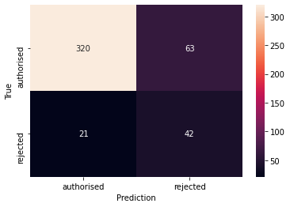

# PharmaPredict
Based on [historical data](https://www.ema.europa.eu/en/medicines/download-medicine-data) of authorised, refused and withdrawn drug/indication pairs we aim at predicting market authorisation of new pharmaceutical candidates. Given the simple user input of INN (international nonproprietary name), therapeutic area and [orphan medicine](https://en.wikipedia.org/wiki/Orphan_drug) status we aggregate additional features from the [ClinicalTrials.gov](https://clinicaltrials.gov/api/) and [PubMed](https://www.ncbi.nlm.nih.gov/home/develop/api/) APIs. Apart from numerical and one categorial features, we use [Tf-idf-vectoriced](https://scikit-learn.org/stable/modules/feature_extraction.html#tfidf-term-weighting) abstracts to train a [Random Forest Classifier](https://scikit-learn.org/stable/modules/ensemble.html#random-forests).

▶ [Live demo](https://pharmapredict.herokuapp.com/)

## Methodology
### Data sources
[EMA](https://www.ema.europa.eu/en/medicines/download-medicine-data)

[PubMed](https://pubmed.ncbi.nlm.nih.gov/)

[ClinicalTrials.gov](https://clinicaltrials.gov/)

### Construction of dataset
From the EMA Excel sheet (see above), colulmns 'Medicine name', 'Therapeutic area', 'INN', 'Authorisation status', 'Generic, 'Biosimilar', 'Orphan medicine' and 'First published' were selected. The file was filtered to only show entries with Authorisation status 'refused' or 'authorised'.
Entries in 'Therapeutic area' were manually transformed to represent multiple therapeutic areas separated by comma.
For each row, searches in the PubMed and ClinicalTrials API were conducted using the following formula: (therapeutic_area_1 OR therapeutic_area_2 etc) AND (INN) AND (date < 'First published'). From these search queries, the remaining columns were filled.

### Data challenges

Data challenges included relatively few observations to base a model on and  significant class imbalance to the dataset.
These problems were primarily mitigated by choosing a simple model that adjusts well to class imbalance - the `Random Forest`
algorithm.

### Pre-processing Steps

Due to the nature of the search function - namely that additional therapeutic areas increased the scope of the search parameters,
a **new feature** relating to this number was introduced. The text collected from the abstracts within *PubMed* was passed to
the `Tf-Idf vectorizer` to select the 50 most significant words. Additionally, the numerical features were `scaled` to ensure
that they fell between 0 and 1 to ensure consistent weighting.

### Additional Experiments

During the course of the project, experimental approaches were taken in order to find the most effective model. These included
using `Random Forest` *feature importance* to isolate the most significant of the numerical fields, taking *percentages* of
total trial numbers instead of the raw number and using an up-sampling algorithm (`SMOTE`) to adjust the imbalance in our target
variable. However, none of these methods improved our model.

### Model Selection

Approaches here included:

  - splitting the dataset into numerical and text based features and passing them to different models using a `Stacking` methodology.
  - Passing all features, post pre-processing, into a `Random Forest` algorithm.

Although the `Stacking` method was marginally more predictive, the `Random Forest` performed well and was ultimately chosen
for ease of implementation and reproducibility. The final model recorded an area under the curve score (a metric to show the
ability to differentiate the two classes) of **80%**. Also note the confusion matrix below, which demostrates the predictions of our model on the test set.

*Confusion matrix (y-axis: true labels, x-axis: predicted labels)*

### Project Conclusions and Further Work

The project was particularly interesting due to the real world nature of the task, the challenges inherent in small,
unbalanced data and a dataset containing both numerical and text features. The resulting model performed reasonably well and
the **webapp** (see above) provides a quick solution to the likelihood of drug approval. Given more time, the project would
seek to increase the data from which to train a more effective model, either through the passage of time or with the help of
a commercial data supplier.

### Acknowledgements

With thanks to **Le Wagon Lisbon staff**, and all those that contribute to the following:

`pandas`, `numpy`, `scikit-learn`, `nltk`, `streamlit`, `heroku`,`github`, `joblib` and, of course, `python`.
